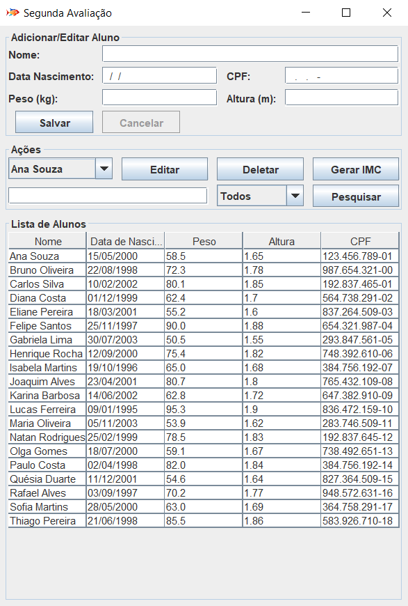

# Projeto de Sistema de Gestão de Alunos e Cálculo de IMC

Este projeto foi desenvolvido em Java com integração ao banco de dados MySQL para gerenciar informações de alunos e calcular o Índice de Massa Corporal (IMC). O sistema permite o cadastro, atualização, exclusão e consulta de alunos, além de calcular o IMC e registrar as informações em arquivos de texto.

## Funcionalidades

O sistema possui as seguintes funcionalidades:

- **Cadastro de Aluno**: Permite inserir novos alunos no sistema com os seguintes dados:
    - CPF
    - Nome
    - Data de Nascimento
    - Peso
    - Altura
- **Exclusão de Aluno**: Permite excluir um aluno do sistema.
- **Atualização de Dados**: Permite atualizar as informações de um aluno já cadastrado.
- **Consulta de Aluno**: Permite consultar os dados de um aluno.
- **Cálculo do IMC**: Calcula o IMC de um aluno e grava os dados (data do cálculo, CPF, nome, IMC e interpretação) em um arquivo de texto. Cada aluno terá um arquivo de texto único para registrar os cálculos realizados.

## Estrutura do Projeto

O projeto é estruturado em pacotes para promover uma arquitetura organizada:

- **factory**: Contém as classes responsáveis por criar objetos do sistema, como o objeto aluno e as conexões com o banco de dados.
- **modelo**: Contém as classes de modelo, incluindo a classe `Aluno`, que possui os atributos e métodos para manipular os dados dos alunos.
- **dao**: Contém as classes de acesso a dados (DAO - Data Access Object), responsáveis pela interação com o banco de dados MySQL.
- **gui**: Contém as classes para a interface gráfica, onde o usuário pode interagir com o sistema.

## Tecnologias Utilizadas

- **Java**: Linguagem de programação principal utilizada no projeto.
- **MySQL**: Sistema de gerenciamento de banco de dados utilizado para armazenar as informações dos alunos.
- **JDBC**: Utilizado para a conexão e manipulação do banco de dados MySQL a partir do Java.
- **Swing** (ou outra biblioteca de sua escolha): Para a criação da interface gráfica (GUI).

## Instruções de Instalação e Execução

### Pré-requisitos

Antes de executar o programa, certifique-se de ter as seguintes ferramentas instaladas:

- **Java Development Kit (JDK)**
- **MySQL** instalado e configurado
- **IDE** IntelliJ IDEA, Eclipse ou NetBeans
- **MySQL Workbench** (opcional, mas recomendado para gerenciar o banco de dados)

### Passos para Configuração e Execução

1. Faça o download do código-fonte do projeto ou clone o repositório usando Git
   `git clone https://github.com/HumbertoIshii/2ndAval.git `
2. Configure a senha no arquivo src/factory/ConnectionFactory.java
2. Configure o banco de dados no projeto utilizando o arquivo resources/database.sql
3. Adicione a biblioteca [ConnectorJ](https://dev.mysql.com/downloads/connector/j/)
4. Execute o programa pelo arquivo src/Main.java

## Imagem da Interface

